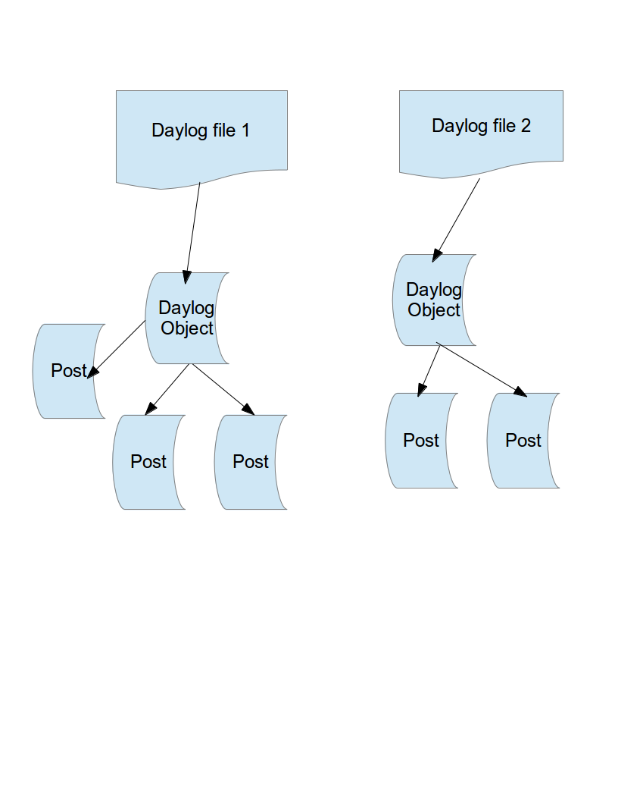

Data structure
==============

Top-down view:
daylog -  is a day's thought summary
one daylog might consist of several posts. A daylog might also have general topicless resume

post - is a specific thought on a topic, consisting of title, marking/rating and content (thoughts about that topic)

For a visual representation see data structure image below

